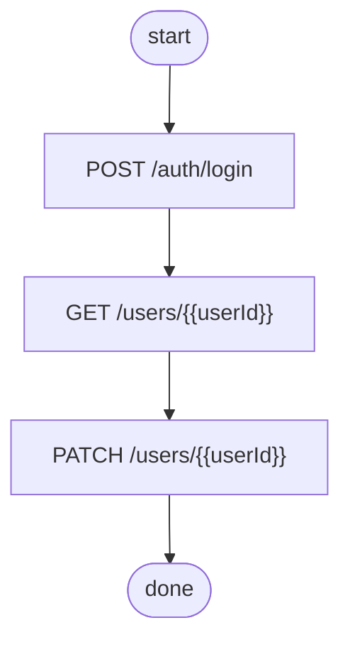
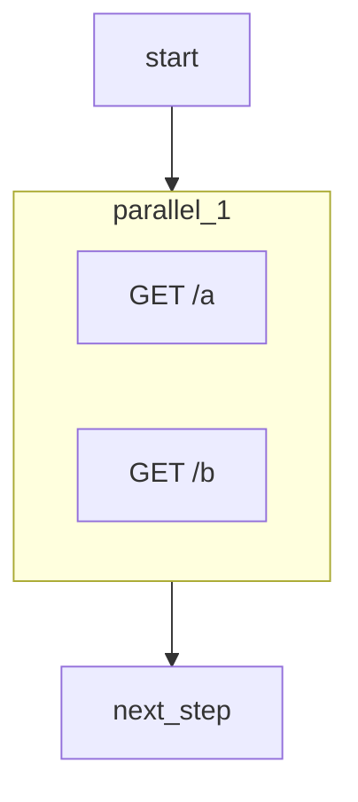

# Feature Roadmap

Planned features and compatibility improvements across the workspace. Each entry
covers the user-facing goal, which crates change, the data model / API shape,
implementation notes, new dependencies, and a test strategy.

Features are grouped by area. Priority column at the end summarises value vs
effort for sequencing.

---

## Table of contents

1. [Protocol extensions](#1-protocol-extensions)
   - [1.1 GraphQL](#11-graphql-support)
   - [1.2 WebSocket](#12-websocket-test-cases)
   - [1.3 gRPC](#13-grpc)
2. [Format and compatibility](#2-format-and-compatibility)
   - [2.1 HAR import](#21-har-import)
   - [2.2 Postman dynamic variables](#22-postman-dynamic-variables)
   - [2.3 Bruno assert and vars blocks](#23-bruno-assert-and-vars-blocks)
   - [2.4 OpenAPI 3.1](#24-openapi-31)
3. [Testing capabilities](#3-testing-capabilities)
   - [3.1 Data-driven parameterised tests](#31-data-driven-parameterised-tests)
   - [3.2 Snapshot / diff testing](#32-snapshot--diff-testing)
   - [3.3 OpenAPI response validation](#33-openapi-response-validation)
   - [3.4 Load and concurrency mode](#34-load-and-concurrency-mode)
4. [Auth helpers](#4-auth-helpers)
   - [4.1 OAuth2 client-credentials](#41-oauth2-client-credentials-flow)
   - [4.2 AWS Signature v4](#42-aws-signature-v4)
   - [4.3 OIDC / OpenID Connect](#43-oidc--openid-connect)
5. [Developer experience](#5-developer-experience)
   - [5.1 LSP for .http files](#51-lsp--language-server-for-http-files)
   - [5.2 Proxy / record mode](#52-proxy--record-mode)
   - [5.3 JUnit XML / CTRF output](#53-junit-xml--ctrf-output)
   - [5.4 Flow dependency graph](#54-dependency-graph-for-flows)
6. [Priority matrix](#6-priority-matrix)

---

## 1. Protocol extensions

### 1.1 GraphQL support

**Goal**: run GraphQL queries and mutations from `.http` files or `.graphql`
files with the same pre/post-script model as REST.

#### Crates affected

| Crate | Change |
| ----- | ------ |
| `hello_core` | New `GraphqlRequest` type; parser extension; `GraphqlAdapter` |
| `hello_client` | Runner phase for GraphQL; sandbox input shape |

#### Data model

New type in `hello_core::http_request`:

```rust
pub struct GraphqlRequest {
    pub url: String,
    pub operation: GraphqlOperation,  // Query | Mutation | Subscription
    pub query: String,
    pub variables: Option<serde_json::Value>,
    pub operation_name: Option<String>,
}
```

`RequestEntry` gains a new variant:

```rust
pub enum RequestKind<'a> {
    Http(HttpRequest<'a>),
    Graphql(GraphqlRequest),
}
```

#### Parser changes (`hello_core::client_parser`)

Detect a `GRAPHQL` pseudo-method line:

```
GRAPHQL https://api.example.com/graphql

query GetUser($id: ID!) {
  user(id: $id) { name email }
}

### @variables
{"id": "42"}
```

The body up to `### @variables` is the query string; the JSON block after is
variables.

Alternatively, a `.graphql` file reference:

```
GRAPHQL https://api.example.com/graphql > get_user.graphql
### @variables {"id": "42"}
```

#### `GraphqlAdapter` (`hello_core::adapters::graphql`)

Accepts a standalone `.graphql` file (query only — URL supplied by CLI
`--url` flag or `### @endpoint`).

#### Runner changes (`hello_client::http_runner`)

Before Phase 2 (fetch), serialize `GraphqlRequest` to the standard JSON wire
format:

```json
{ "query": "...", "variables": {...}, "operationName": "..." }
```

Inject `Content-Type: application/json` and `Accept: application/json`.

Post-script input `_response` gains two extra fields:

```json
{
  "data": { ... },
  "errors": [ { "message": "...", "locations": [...] } ]
}
```

Optional introspection check: if `### @introspect` metadata tag is present,
run an introspection query on first execution and validate field names.
Cache the schema in the KV store keyed by URL.

#### New dependencies

None — GraphQL over HTTP is plain JSON. Introspection parsing uses
`serde_json::Value`.

#### Tests

- Unit: `client_parser` parses inline query + variables block.
- Integration (`http_runner_tests`): mock server returns `{"data":{"user":{"name":"Alice"}}}`;
  post-script asserts `response.data.user.name === "Alice"`.
- Error path: response with `errors` array → post-script receives errors.

---

### 1.2 WebSocket test cases

**Goal**: send a sequence of WebSocket frames and assert on received messages
from a post-script.

#### Crates affected

| Crate | Change |
| ----- | ------ |
| `hello_core` | New `WsRequest` type |
| `hello_sandbox` | New `WsPack` SDK extension |
| `hello_client` | Runner phase for WS; `RunCapabilities` extension |

#### Data model

```rust
pub struct WsRequest {
    pub url: String,             // ws:// or wss://
    pub headers: Vec<(String, String)>,
    pub send: Vec<WsFrame>,
    pub receive_timeout_ms: u64,
}

pub enum WsFrame {
    Text(String),
    Binary(Vec<u8>),
    Close,
}
```

#### Parser changes

```
WS wss://echo.example.com/ws
Authorization: Bearer {{token}}

> 
```

`WS` pseudo-method triggers `WsRequest`. The pre/post-script model is replaced
by a single inline script that controls the full session.

#### `WsPack` sandbox extension

Registered only when `RunCapabilities::ws_allowed` is true. Exposed ops:

```js
const ws = sandbox.ws;
await ws.connect();          // called automatically before script
ws.send(text);               // send text frame
ws.sendBinary(base64);       // send binary frame
const msg = await ws.receive(timeoutMs);
ws.close();
```

Implemented via `tokio-tungstenite` in a new `op_ws_*` op set.

#### New dependencies

| Crate | Feature |
| ----- | ------- |
| `tokio-tungstenite` | `rustls-tls` |

#### Tests

- Integration: start a small echo WS server with `tokio-tungstenite` in test;
  run a WS test case that sends "ping" and asserts receive "ping".
- Timeout path: server doesn't respond → `receive` rejects with timeout error.

---

### 1.3 gRPC

**Goal**: test gRPC services from `.proto` file definitions without code
generation.

#### Crates affected

| Crate | Change |
| ----- | ------ |
| `hello_core` | `GrpcAdapter` parsing `.proto`; `GrpcRequest` type |
| `hello_client` | Runner phase using reflection or direct protobuf encoding |

#### Data model

```rust
pub struct GrpcRequest {
    pub endpoint: String,        // host:port
    pub service: String,         // "helloworld.Greeter"
    pub method: String,          // "SayHello"
    pub message: serde_json::Value,  // transcoded to protobuf at runtime
    pub tls: bool,
    pub metadata: Vec<(String, String)>,
}
```

#### Implementation approach

Two modes (controlled by `### @grpc-mode`):

1. **Reflection mode** (default): query gRPC server reflection to get service
   descriptors at runtime. No `.proto` file needed. Uses
   `tonic + prost` to encode the JSON message to protobuf.

2. **Proto mode**: parse a `.proto` file with `protox` (pure-Rust proto parser)
   to get field descriptors; transcode JSON → protobuf message without tonic
   codegen.

`.http` file syntax:

```
GRPC localhost:50051/helloworld.Greeter/SayHello
Content-Type: application/grpc+json

{"name": "world"}
```

#### New dependencies

| Crate | Notes |
| ----- | ----- |
| `tonic` | gRPC channel + reflection client |
| `prost` | protobuf encoding |
| `protox` | `.proto` file parsing (no codegen) |

Heavy dependency — implement as an optional feature flag
`hello_client = { features = ["grpc"] }`.

#### Tests

- Use `tonic`'s built-in helloworld example server in a test harness.
- Assert response field values via post-script.

---

## 2. Format and compatibility

### 2.1 HAR import

**Goal**: convert a browser `.har` export into a `.http` file or directly into
a `MockCollection` / `TestCollection`.

#### Crates affected

| Crate | Change |
| ----- | ------ |
| `hello_core` | New `HarAdapter` |

#### HAR schema (relevant subset)

```json
{
  "log": {
    "entries": [
      {
        "request": {
          "method": "GET",
          "url": "https://api.example.com/users",
          "headers": [...],
          "postData": { "mimeType": "application/json", "text": "{}" }
        },
        "response": {
          "status": 200,
          "headers": [...],
          "content": { "mimeType": "application/json", "text": "{...}" }
        }
      }
    ]
  }
}
```

#### `HarAdapter`

```rust
pub struct HarAdapter {
    pub filter_status: Option<RangeInclusive<u16>>,  // default 200..=599
    pub deduplicate: bool,   // merge identical method+path pairs
    pub base_url: Option<String>,  // strip prefix to get relative path
}

impl IngestAdapter for HarAdapter {
    fn ingest(&self, source: &str) -> anyhow::Result<MockCollection>;
}
```

Each `entry` → one `MockRoute` with the recorded response as `MockResponse`.
When `deduplicate = true`, collapse entries with the same `(method, path)` into
one route with `SelectionStrategy::RoundRobin` across all recorded responses.

#### CLI integration

```
hello_server recording.har --format har
hello_client --import recording.har --output requests.http
```

The `--import` flag for `hello_client` writes a `.http` file with
`### @response` annotations from the HAR responses.

#### New dependencies

None — HAR is plain JSON; parsed with `serde_json`.

#### Tests

- Unit: parse a minimal HAR fixture string; assert route count and body.
- Deduplication: two entries for same endpoint → `RoundRobin` with two responses.
- Filter: `filter_status = 200..=299` excludes redirect entries.

---

### 2.2 Postman dynamic variables

**Goal**: implement Postman's built-in `{{$…}}` dynamic variables in the
interpolation layer and in `PmPack`.

#### Crates affected

| Crate | Change |
| ----- | ------ |
| `hello_core` | Extend `interpolate` to resolve `$`-prefixed names |
| `hello_sandbox::sdk::pm` | Extend `pm.variables.replaceIn` |

#### Variable catalogue

| Variable | Value |
| -------- | ----- |
| `{{$guid}}` | Random UUID v4 |
| `{{$randomInt}}` | Random integer 0–1000 |
| `{{$randomFirstName}}` | Random first name from a small embedded list |
| `{{$randomLastName}}` | Random last name |
| `{{$randomEmail}}` | `<first>.<last>@example.com` |
| `{{$randomBoolean}}` | `"true"` or `"false"` |
| `{{$isoTimestamp}}` | Current UTC time in ISO 8601 |
| `{{$timestamp}}` | Unix epoch seconds as a string |
| `{{$randomLoremIpsum}}` | Short lorem ipsum sentence |

#### Implementation

In `hello_core::interpolate`, before looking up user-provided env keys, check
if the key starts with `$`:

```rust
fn resolve_builtin(key: &str) -> Option<String> {
    match key {
        "$guid"           => Some(uuid::Uuid::new_v4().to_string()),
        "$isoTimestamp"   => Some(Utc::now().to_rfc3339()),
        "$timestamp"      => Some(Utc::now().timestamp().to_string()),
        "$randomInt"      => Some(rand::random::<u16>().to_string()),
        "$randomBoolean"  => Some(if rand::random() { "true" } else { "false" }.to_string()),
        _                 => None,
    }
}
```

String-table variables (`$randomFirstName`, etc.) use a small `const` array
embedded in the binary — no file I/O.

In `PmPack`, `pm.variables.replaceIn("{{$guid}}")` calls the same resolver via
a new `op_pm_resolve_builtin` op.

#### New dependencies

`chrono` (for `$isoTimestamp`) — add to workspace if not already present.

#### Tests

- Unit: `interpolate("{{$guid}}", {})` returns a valid UUID.
- Unit: `interpolate("{{$isoTimestamp}}", {})` parses as RFC 3339.
- Unit: user key `$myVar` in env is used as-is (builtins only for `$`-names
  that match the catalogue; unrecognised `$names` fall through to env lookup).

---

### 2.3 Bruno `assert` and `vars` blocks

**Goal**: translate Bruno's native `assert` and `vars:pre-request` /
`vars:post-response` blocks into pre/post scripts automatically, so `.bru`
files run without manual migration.

#### Crates affected

| Crate | Change |
| ----- | ------ |
| `hello_core::adapters::bruno` | Parse `assert`, `vars:pre-request`, `vars:post-response` blocks |
| `hello_core::adapters::bru_parser` | New nom parsers for block types |

#### Bruno block syntax

```bru
vars:pre-request {
  userId: 42
  token: {{authToken}}
}

assert {
  res.status: eq 200
  res.body.id: eq 42
  res.body.name: isString
}

vars:post-response {
  createdId: res.body.id
}
```

#### Translation rules

**`vars:pre-request`** → appended to `pre_script`:

```js
sandbox.env.set("userId", "42");
sandbox.env.set("token", sandbox.env.get("authToken"));
```

**`vars:post-response`** → prepended to `post_script` (before `results()`):

```js
const _r = wrapResponse(sandbox.readInput("_response"));
sandbox.env.set("createdId", _r.json().id);
```

**`assert`** → appended to `post_script` (after vars capture):

```js
expect(response.status).toBe(200);
expect(response.body.id).toBe(42);
expect(typeof response.body.name).toBe("string");
```

Bruno operators to support in the first pass: `eq`, `neq`, `gt`, `lt`, `gte`,
`lte`, `isString`, `isNumber`, `isBoolean`, `isNull`, `isArray`, `isObject`,
`contains`, `notContains`.

#### Struct changes

```rust
pub struct BruRequestItem {
    // existing fields ...
    pub pre_request_vars: Vec<(String, String)>,
    pub post_response_vars: Vec<(String, BrunoExpr)>,
    pub asserts: Vec<BrunoAssert>,
}

pub struct BrunoAssert {
    pub expr: BrunoExpr,   // "res.status", "res.body.id"
    pub operator: AssertOp,
    pub expected: BrunoValue,
}
```

#### Tests

- Unit (`bru_parser`): parse each block type from a fixture string.
- Integration: `.bru` file with `assert { res.status: eq 200 }` → `TestResult.pass == true` against a mock.
- Negative: `assert { res.status: eq 404 }` against a 200 response → `pass == false` with a descriptive failure message.

---

### 2.4 OpenAPI 3.1

**Goal**: correctly parse OpenAPI 3.1 documents, which differ from 3.0 in
nullable types, webhooks, and JSON Schema alignment.

#### Crates affected

| Crate | Change |
| ----- | ------ |
| `hello_core::adapters::openapi` | Version-dispatch; 3.1 schema normalisation |

#### Key 3.0 → 3.1 differences

| Feature | 3.0 | 3.1 |
| ------- | --- | --- |
| Nullable | `nullable: true` + `type: string` | `type: ["string", "null"]` |
| Exclusive min/max | `exclusiveMinimum: bool` | `exclusiveMinimum: number` |
| Webhooks | Not supported | Top-level `webhooks` object |
| JSON Schema | Subset | Full JSON Schema 2020-12 |
| `$schema` | Not present | `"https://spec.openapis.org/oas/3.1/schema"` |

#### Implementation

Detect version from the `openapi:` field:

```rust
fn parse_openapi(source: &str) -> anyhow::Result<MockCollection> {
    let version = sniff_openapi_version(source)?;
    match version {
        (3, 0, _) => parse_v30(source),
        (3, 1, _) => parse_v31(source),
        _ => Err(anyhow!("unsupported OpenAPI version {version}")),
    }
}
```

`parse_v31` adds:
- Schema normalisation: `type: ["string", "null"]` → treated as optional string.
- Webhooks: parsed as additional routes with method `ANY` and path
  `/_webhook/<name>` (useful for mock server).
- `$ref` resolution across `$defs` in addition to `#/components/schemas`.

#### Tests

- Unit: parse a 3.1 spec with `nullable` via array type; assert schema example
  extracted correctly.
- Unit: parse `webhooks` block; assert route created.
- Regression: existing 3.0 fixtures still parse identically.

---

## 3. Testing capabilities

### 3.1 Data-driven (parameterised) test cases

**Goal**: run the same `.http` collection N times with different variable values
from a CSV or JSON data file — equivalent to Postman's Collection Runner data
files.

#### Crates affected

| Crate | Change |
| ----- | ------ |
| `hello_client` | `DataFile`, `DataRow`; runner iteration; `CollectionResult` aggregation |
| `hello_client::main` | `--data` CLI flag |

#### Data file formats

**CSV** (headers become variable names):

```csv
userId,token
1,tok-abc
2,tok-def
```

**JSON array**:

```json
[
  { "userId": 1, "token": "tok-abc" },
  { "userId": 2, "token": "tok-def" }
]
```

#### API changes

```rust
pub struct DataFile {
    pub rows: Vec<HashMap<String, String>>,
}

impl DataFile {
    pub fn from_csv(src: &str) -> anyhow::Result<Self>;
    pub fn from_json(src: &str) -> anyhow::Result<Self>;
}
```

`run_collection_from_str` gains an optional `data: Option<DataFile>` parameter.
When present, the entire collection is run once per data row, with row values
merged into the env (row values take lowest priority — explicit `--param`
overrides them).

`CollectionResult` gains:

```rust
pub struct CollectionResult {
    // existing fields ...
    pub iterations: Vec<IterationResult>,
}

pub struct IterationResult {
    pub row_index: usize,
    pub row: HashMap<String, String>,
    pub results: Vec<TestResult>,
}
```

#### CLI

```
hello_client -r requests.http --data users.csv
hello_client -r requests.http --data cases.json --parallel 4
```

`--parallel N` runs N iterations concurrently. The existing `LocalSet`
constraint still applies per sandbox — each iteration gets its own pool slot.

#### Tests

- Unit: `DataFile::from_csv` with two rows; assert `rows.len() == 2`.
- Integration: run a 2-row CSV against a mock; assert `iterations.len() == 2`
  and each has correct env substitution.
- `--parallel 2`: both iterations complete; no data race in result collection.

---

### 3.2 Snapshot / diff testing

**Goal**: capture a response body on first run and assert it hasn't changed on
subsequent runs — regression safety without writing manual assertions.

#### Crates affected

| Crate | Change |
| ----- | ------ |
| `hello_client` | Snapshot store, diff logic, `TestResult` extension |
| `hello_client::main` | `--update-snapshots` flag |

#### `.http` syntax

```
GET https://api.example.com/users/1

### @snapshot users_get_one
```

The `@snapshot <name>` tag opts this test case into snapshot mode.

#### Snapshot store

Snapshots are stored alongside the `.http` file in a `__snapshots__/`
directory:

```
requests.http
__snapshots__/
  users_get_one.json
```

The stored file is the pretty-printed response body (JSON if parseable,
otherwise raw text). A `__snapshots__/<name>.meta.json` file stores the
snapshot status, content-type, and creation timestamp.

#### Execution logic

```
if snapshot file absent:
    write response body → snapshot file
    TestResult: pass=true, note="snapshot created"
elif --update-snapshots flag:
    overwrite snapshot file
    TestResult: pass=true, note="snapshot updated"
else:
    diff stored vs actual
    if identical: pass=true
    else: pass=false, failures=["snapshot mismatch:\n<diff>"]
```

Diff output uses a unified diff format (line-by-line for JSON, character-level
for text). For JSON, diff is performed on the _parsed_ value (key-order
independent) with the diff rendered on re-serialised pretty-printed form.

#### `TestResult` extension

```rust
pub struct TestResult {
    // existing fields ...
    pub snapshot: Option<SnapshotOutcome>,
}

pub enum SnapshotOutcome {
    Created,
    Updated,
    Matched,
    Mismatch { diff: String },
}
```

#### Tests

- Unit: first run creates snapshot file.
- Unit: second run with unchanged response → `Matched`.
- Unit: second run with changed response → `Mismatch` with diff string.
- Unit: `--update-snapshots` overwrites.
- JSON key-order independence: `{"b":1,"a":2}` matches `{"a":2,"b":1}`.

---

### 3.3 OpenAPI response validation

**Goal**: after each HTTP response, validate the body against the OpenAPI schema
for that operation + status code and report schema violations as structured
failures.

#### Crates affected

| Crate | Change |
| ----- | ------ |
| `hello_core::adapters::openapi` | Expose schemas alongside examples |
| `hello_client::http_runner` | Optional validation phase after Phase 2 |

#### Schema extraction

`OpenApiAdapter` currently extracts only examples. It needs to also expose
schemas:

```rust
pub struct RouteSchema {
    pub operation_id: String,
    pub method: String,
    pub path: String,
    pub response_schemas: HashMap<u16, serde_json::Value>,  // status → JSON Schema
}
```

Stored alongside `MockCollection` (or as a parallel `SchemaCollection`).

#### Validation phase (Phase 2.5)

When `TestCase` carries a `schema: Option<serde_json::Value>` (populated by
`runner.rs` when it can match the request URL+method to an OpenAPI route):

```
after Phase 2 fetch:
    if schema present:
        validate response.body against schema
        append violations to TestResult.schema_violations
```

Validation uses `jsonschema` crate (pure Rust, no external deps).

`TestResult`:

```rust
pub struct TestResult {
    // existing fields ...
    pub schema_violations: Vec<SchemaViolation>,
}

pub struct SchemaViolation {
    pub path: String,       // JSON pointer, e.g. "/data/0/name"
    pub message: String,
}
```

Schema violations do **not** affect `pass` by default; they are reported
separately. A `### @strict-schema` tag promotes violations to failures.

#### CLI

```
hello_client -r requests.http --schema petstore.yaml
```

`--schema` loads an OpenAPI file used only for validation (not for running
requests). The runner matches each request's `method + path` against the schema
routes.

#### Tests

- Unit: valid response against schema → zero violations.
- Unit: missing required field → one `SchemaViolation` with correct path.
- Unit: `@strict-schema` + violation → `pass = false`.
- Integration: run against mock; supply mismatched schema; assert violations reported.

---

### 3.4 Load and concurrency mode

**Goal**: run a collection under load (N iterations, C concurrent workers) and
report latency percentiles.

#### Crates affected

| Crate | Change |
| ----- | ------ |
| `hello_client` | `LoadConfig`, `LoadResult`, `run_load` |
| `hello_client::main` | `--repeat`, `--concurrency` flags |

#### API

```rust
pub struct LoadConfig {
    pub iterations: usize,    // total requests per test case
    pub concurrency: usize,   // parallel workers (each gets its own pool slot)
    pub ramp_up_ms: u64,      // stagger worker start by this interval
    pub think_time_ms: u64,   // delay between iterations per worker
}

pub struct LoadResult {
    pub total: usize,
    pub passed: usize,
    pub failed: usize,
    pub latency_p50_ms: u64,
    pub latency_p95_ms: u64,
    pub latency_p99_ms: u64,
    pub latency_max_ms: u64,
    pub throughput_rps: f64,
    pub errors: Vec<String>,
}
```

`run_load(cases: Vec<TestCase>, config: LoadConfig) -> LoadResult` spawns
`concurrency` `tokio` tasks, each running `iterations / concurrency` requests,
collecting `PhaseTimings` into a shared `Vec`. Percentiles computed from the
sorted latency vector after all tasks complete.

The existing `SqliteHistorySink` receives all load-test requests — no special
handling needed.

#### CLI

```
hello_client -r requests.http --repeat 1000 --concurrency 20 --ramp-up 500
```

Output in `pretty` format:

```
Load test: 1000 requests × 20 workers
  Passed:  998 / 1000
  Failed:  2
  p50:     42 ms
  p95:     118 ms
  p99:     204 ms
  max:     391 ms
  RPS:     187.4
```

#### V8 constraint note

Each concurrent worker needs its own `Sandbox` pool slot. The pool must be
sized to `concurrency`. The `pool_size` in `PoolConfig` is set to
`load_config.concurrency` automatically for load runs.

#### Tests

- Unit: `LoadResult` percentile computation from a known latency vector.
- Integration: 10 iterations × 2 workers against a mock; assert `total == 10`,
  `latency_p99_ms` is populated.

---

## 4. Auth helpers

### 4.1 OAuth2 client-credentials flow

**Goal**: automatically fetch and cache a Bearer token before requests that
carry a `### @auth oauth2` metadata tag.

#### Crates affected

| Crate | Change |
| ----- | ------ |
| `hello_client::http_runner` | Auth pre-phase (Phase 0) before pre-script |
| `hello_client` | `AuthConfig`, `TokenCache` (backed by KV store) |

#### `.http` syntax

```
### @auth oauth2
### @auth-token-url https://auth.example.com/oauth/token
### @auth-client-id my_client
### @auth-client-secret {{CLIENT_SECRET}}
### @auth-scope api.read api.write

GET https://api.example.com/users
```

Environment variable interpolation in `@auth-*` tags is resolved before the
fetch.

#### `AuthConfig`

```rust
pub enum AuthConfig {
    None,
    OAuth2ClientCredentials {
        token_url: String,
        client_id: String,
        client_secret: String,   // resolved from env at runtime
        scope: Vec<String>,
    },
    AwsSigV4 { /* see §4.2 */ },
}
```

Parsed from metadata tags by `runner.rs::entry_to_test_case`.

#### Token cache

Tokens are cached in the sandbox KV store:

```
key:   "oauth2:token:<client_id>:<scope_hash>"
value: "<access_token>"
ttl:   expires_in - 30s (30s safety margin)
```

Phase 0 (new, before pre-script):

```
if auth == OAuth2:
    check KV for cached token
    if miss or expired:
        POST token_url with client_credentials grant
        store token in KV with TTL
    inject Authorization: Bearer <token> into effective_request.headers
```

The token fetch itself uses `reqwest` directly (not the sandbox HTTP op) so
that the auth fetch is not subject to `allowed_prefixes` restrictions.

#### New dependencies

None — token endpoint is a standard `application/x-www-form-urlencoded` POST
parseable with existing `reqwest`.

#### Tests

- Unit: `AuthConfig` parsed from metadata tags.
- Integration: mock token endpoint returns `{"access_token":"tok","expires_in":3600}`;
  assert `Authorization: Bearer tok` header injected.
- Cache hit: second request does not call token endpoint.
- Expiry: mock token with `expires_in: 1`; sleep 2 s; assert second request
  fetches fresh token.

---

### 4.2 AWS Signature v4

**Goal**: sign requests with AWS Signature Version 4 for services like API
Gateway, S3, or AppSync.

#### Crates affected

| Crate | Change |
| ----- | ------ |
| `hello_client` | `AwsSigV4Signer`; new `AuthConfig::AwsSigV4` variant |

#### `.http` syntax

```
### @auth aws-sigv4
### @auth-aws-region us-east-1
### @auth-aws-service execute-api
### @auth-aws-profile default

GET https://abc123.execute-api.us-east-1.amazonaws.com/prod/users
```

Credentials resolved in order:
1. `### @auth-aws-access-key` / `### @auth-aws-secret-key` metadata.
2. Environment variables `AWS_ACCESS_KEY_ID` / `AWS_SECRET_ACCESS_KEY`.
3. `~/.aws/credentials` file, profile from `### @auth-aws-profile` or `default`.

#### Implementation

`AwsSigV4Signer` (pure Rust, no AWS SDK):

```rust
pub struct AwsSigV4Signer {
    pub access_key: String,
    pub secret_key: String,
    pub session_token: Option<String>,
    pub region: String,
    pub service: String,
}

impl AwsSigV4Signer {
    pub fn sign(&self, request: &mut HttpRequest, body: &[u8], now: DateTime<Utc>);
}
```

`sign` computes and injects `Authorization`, `X-Amz-Date`, and optionally
`X-Amz-Security-Token` headers per the SigV4 spec:

1. Canonical request: method + URI + query + signed headers + body SHA-256.
2. String to sign: `AWS4-HMAC-SHA256` + timestamp + credential scope + hash.
3. Signing key: HMAC chain over date → region → service → `aws4_request`.
4. Signature: HMAC of string-to-sign with signing key.

#### New dependencies

| Crate | Use |
| ----- | --- |
| `hmac` | HMAC-SHA256 |
| `sha2` | SHA-256 body hash |
| `chrono` | Timestamp formatting |

All three are small, no-std-compatible crates. Add to workspace.

#### Tests

- Unit: sign a known request against the AWS SigV4 test suite vectors
  (published by AWS at docs.aws.amazon.com/general/latest/gr/sigv4-test-suite).
- Integration: real API Gateway endpoint (optional, skipped in CI unless
  `INTEGRATION_TEST=1`).

---

### 4.3 OIDC / OpenID Connect

**Goal**: support OIDC device flow and client-credentials-with-PKCE for
interactive and machine-to-machine use cases.

#### Crates affected

Same as §4.1 — extends `AuthConfig` and the Phase 0 auth layer.

#### New `AuthConfig` variants

```rust
pub enum AuthConfig {
    // existing variants ...
    OidcClientCredentials {
        discovery_url: String,   // /.well-known/openid-configuration
        client_id: String,
        client_secret: String,
        scope: Vec<String>,
    },
    OidcDeviceFlow {
        discovery_url: String,
        client_id: String,
        scope: Vec<String>,
    },
}
```

#### OIDC client-credentials

1. Fetch `discovery_url` to get `token_endpoint`.
2. Perform standard OAuth2 client-credentials grant (same as §4.1) against
   `token_endpoint`.
3. Optionally validate the JWT using the JWKS from `jwks_uri` in the discovery
   document.

JWT validation uses `jsonwebtoken` crate (pure Rust). Validation is opt-in via
`### @auth-validate-jwt true`.

#### OIDC device flow

1. Fetch `device_authorization_endpoint` from discovery document.
2. POST `client_id` + `scope` → receive `device_code`, `user_code`,
   `verification_uri`, `interval`.
3. Print to stderr:
   ```
   Open https://auth.example.com/device and enter code: ABCD-1234
   Waiting...
   ```
4. Poll `token_endpoint` every `interval` seconds until `access_token` received
   or `expires_in` exceeded.
5. Cache token in KV store same as §4.1.

Device flow is only available in interactive CLI mode (not CI / `--no-tty`
flag).

#### New dependencies

| Crate | Use |
| ----- | --- |
| `jsonwebtoken` | JWT validation (optional feature) |

#### Tests

- Unit: discovery document parsed; correct `token_endpoint` extracted.
- Integration (mocked): device flow mock server returns token after one poll.
- JWT validation: valid token passes; expired token fails with clear error.

---

## 5. Developer experience

### 5.1 LSP / language server for `.http` files

**Goal**: provide IDE completions, diagnostics, and navigation for `.http`
files via the Language Server Protocol.

#### New crate: `hello_lsp`

```
crate/hello_lsp/
  Cargo.toml
  src/
    main.rs          stdio transport entry point
    server.rs        LSP request/notification handlers
    analysis.rs      document model + diagnostics
    completion.rs    completions for {{vars}}, methods, headers
    hover.rs         hover for metadata tags
```

Depends on `hello_core` (parser) and `tower-lsp` (LSP server framework).

#### Features

**Diagnostics**
- Parse error at cursor position with span.
- Unknown `### @<tag>` metadata key → warning.
- Unclosed `{{variable}}` placeholder → error.
- Reference to script file that doesn't exist → error.

**Completions**
- `{{` → complete from `--param` values in `.vscode/settings.json` or
  `hello_client.config.json` if present.
- First token on a line → HTTP method completions (`GET`, `POST`, etc. + `GRAPHQL`, `WS`).
- Header name completions after method line (`Authorization:`, `Content-Type:`, etc.).
- `### @` → known metadata tag completions.

**Hover**
- Hover over `### @snapshot <name>` → show snapshot file path.
- Hover over `### @auth oauth2` → explain the auth flow.
- Hover over `{{variable}}` → show resolved value if env file present.

**Go to definition**
- `> post_script.js` script reference → open the file.
- `{{variable}}` → jump to `### @param` declaration.

#### Transport

Launched as `hello_lsp --stdio`. VSCode extension (`hello_client-vscode`)
wraps the binary with a minimal `package.json` and `extension.js`.

JetBrains support via the LSP4IJ plugin (no additional code needed).

#### New dependencies

| Crate | Use |
| ----- | --- |
| `tower-lsp` | LSP server framework |
| `tokio` | Async runtime for LSP |

#### Tests

- Unit: `analysis::diagnostics` on a malformed `.http` string → correct span.
- Integration: `lsp-types` test client sends `textDocument/completion` request;
  asserts completions list contains `Authorization`.

---

### 5.2 Proxy / record mode

**Goal**: start a local HTTP proxy that forwards requests and saves them as a
`.http` file with `### @response` annotations.

#### Crates affected

| Crate | Change |
| ----- | ------ |
| `hello_client::main` | `--record` flag and sub-command |

#### New crate: `hello_proxy` (or module inside `hello_client`)

Given the size, implement as a module `hello_client::proxy` first; extract to a
crate if it grows.

#### How it works

```
curl http://localhost:8080/users   →   proxy   →   https://api.example.com/users
                                    ↓ captures
                                 requests.http (appended)
```

1. Start an `axum` server on `--proxy-port` (default 8080).
2. For each incoming request:
   a. Forward to `--upstream <base_url>`.
   b. Stream response back to caller.
   c. Append to output file in `.http` format with `### @response` block.
3. HTTPS upstream via `reqwest` (existing dep).
4. TLS interception for HTTPS callers: generate a self-signed CA on first run
   (`rcgen` crate); install instructions printed to stderr.

#### Output format

```http
### Recorded 2026-05-25T10:00:00Z
GET /users
Host: api.example.com
Authorization: Bearer <REDACTED>

### @response 200
### @response-header Content-Type application/json
### @response-body {"users": [...]}

###
```

Sensitive headers (`Authorization`, `Cookie`, `X-Api-Key`) are redacted by
default; `--no-redact` disables redaction.

#### CLI

```
hello_client record --upstream https://api.example.com --output recorded.http
hello_client record --upstream https://api.example.com --proxy-port 9090
```

#### New dependencies

| Crate | Use |
| ----- | --- |
| `rcgen` | Self-signed CA for HTTPS interception |
| `rustls` | TLS (already indirect dep via reqwest) |

#### Tests

- Integration: start proxy; send `reqwest` request through it; assert `.http`
  file contains request + response.
- Redaction: `Authorization` header in output is `<REDACTED>`.
- Append mode: two requests → two entries in the output file.

---

### 5.3 JUnit XML / CTRF output

**Goal**: emit machine-readable test reports for CI dashboards and the
[Common Test Report Format](https://ctrf.io).

#### Crates affected

| Crate | Change |
| ----- | ------ |
| `hello_client::main` | `--format junit` and `--format ctrf` |
| `hello_client` | `junit::render`, `ctrf::render` functions |

#### JUnit XML

Standard `<testsuites>` / `<testsuite>` / `<testcase>` format supported by
Jenkins, GitHub Actions test summary, and most CI tools.

Mapping:

| `CollectionResult` field | JUnit element |
| ------------------------ | ------------- |
| collection name | `<testsuite name>` |
| `results[i].name` | `<testcase name>` |
| `results[i].pass == false` | `<failure message>` |
| `results[i].response_time_ms` | `<testcase time>` |
| total elapsed | `<testsuite time>` |

```xml
<?xml version="1.0" encoding="UTF-8"?>
<testsuites>
  <testsuite name="API Tests" tests="5" failures="1" time="0.342">
    <testcase name="GET /users" classname="requests" time="0.042"/>
    <testcase name="POST /users" classname="requests" time="0.118">
      <failure message="Expected status 201, got 400">...</failure>
    </testcase>
  </testsuite>
</testsuites>
```

#### CTRF JSON

```json
{
  "results": {
    "tool": { "name": "hello_client", "version": "0.2.0" },
    "summary": { "tests": 5, "passed": 4, "failed": 1, "start": 0, "stop": 342 },
    "tests": [
      {
        "name": "GET /users",
        "status": "passed",
        "duration": 42
      },
      {
        "name": "POST /users",
        "status": "failed",
        "message": "Expected status 201, got 400",
        "duration": 118
      }
    ]
  }
}
```

#### Implementation

`junit::render(result: &CollectionResult) -> String` and
`ctrf::render(result: &CollectionResult) -> String` are pure functions with no
new dependencies (JUnit uses `std::fmt::Write` for XML; CTRF uses `serde_json`).

#### Tests

- Unit: known `CollectionResult` → rendered XML matches expected string.
- Unit: CTRF JSON parses as valid JSON with correct `summary.failed` count.
- Round-trip: parse rendered JUnit with a minimal XML parser; assert test counts.

---

### 5.4 Dependency graph for flows

**Goal**: render a `FlowDef` as a Mermaid or DOT diagram for documentation.

#### Crates affected

| Crate | Change |
| ----- | ------ |
| `hello_client` | `flow_graph::render_mermaid`, `flow_graph::render_dot` |
| `hello_client::main` | `--graph` sub-command |

#### API

```rust
pub fn render_mermaid(flow: &FlowDef) -> String;
pub fn render_dot(flow: &FlowDef) -> String;
```

No new dependencies — both formats are plain text generation.

#### Mermaid output example



Parallel groups rendered as `subgraph`:



#### CLI

```
hello_client flow --graph --format mermaid requests.flow.json
hello_client flow --graph --format dot requests.flow.json > graph.dot
```

Output is printed to stdout; user pipes to a file or a Mermaid live editor URL.

#### Tests

- Unit: a two-step sequential flow → Mermaid string contains both node names
  and an edge.
- Unit: a parallel group → string contains `subgraph`.

---

## 6. Priority matrix

| Feature | Crate(s) | Value | Effort | Suggested order |
| ------- | -------- | ----- | ------ | --------------- |
| [Data-driven tests](#31-data-driven-parameterised-tests) | `hello_client` | High | Low | 1 |
| [HAR import](#21-har-import) | `hello_core` | High | Low | 2 |
| [JUnit XML / CTRF](#53-junit-xml--ctrf-output) | `hello_client` | High | Low | 3 |
| [Postman dynamic vars](#22-postman-dynamic-variables) | `hello_core` | Medium | Low | 4 |
| [Bruno assert/vars](#23-bruno-assert-and-vars-blocks) | `hello_core` | Medium | Low | 5 |
| [Flow graph](#54-dependency-graph-for-flows) | `hello_client` | Medium | Low | 6 |
| [OAuth2 client-credentials](#41-oauth2-client-credentials-flow) | `hello_client` | High | Medium | 7 |
| [AWS SigV4](#42-aws-signature-v4) | `hello_client` | High | Medium | 8 |
| [Snapshot testing](#32-snapshot--diff-testing) | `hello_client` | Medium | Medium | 9 |
| [OpenAPI 3.1](#24-openapi-31) | `hello_core` | Medium | Medium | 10 |
| [OpenAPI response validation](#33-openapi-response-validation) | `hello_core`, `hello_client` | High | Medium | 11 |
| [Load / concurrency](#34-load-and-concurrency-mode) | `hello_client` | Medium | Medium | 12 |
| [OIDC](#43-oidc--openid-connect) | `hello_client` | Medium | Medium | 13 |
| [Proxy / record](#52-proxy--record-mode) | `hello_client` | Medium | High | 14 |
| [GraphQL](#11-graphql-support) | `hello_core`, `hello_client` | Medium | High | 15 |
| [LSP](#51-lsp--language-server-for-http-files) | `hello_lsp` (new) | High | High | 16 |
| [WebSocket](#12-websocket-test-cases) | `hello_sandbox`, `hello_client` | Low–Medium | High | 17 |
| [gRPC](#13-grpc) | `hello_core`, `hello_client` | Medium | Very high | 18 |
